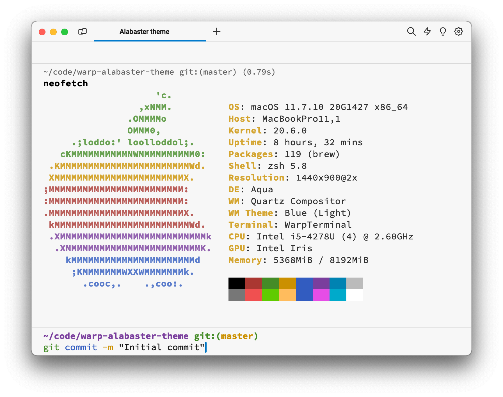

# Alabaster theme

A light color theme for [Warp](https://warp.dev/) based on [Alabaster Color Scheme](https://github.com/tonsky/sublime-scheme-alabaster).

## Installation

1. Download [alabaster.yml](alabaster.yml).
2. `mkdir ~/.warp/themes/`.
3. Place `alabaster.yml` in this directory.
4. `ctrl+cmd+T` → `Alabaster`
